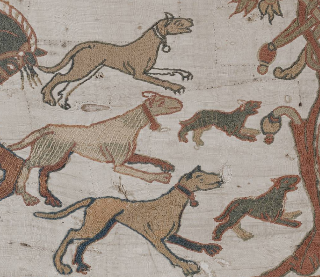

| Image     | Seeds| Segmented |
| ----------- | ----------- | ----------- |
|   |     | |


# semi-supervised-segmentation-on-graphs
- This is a reporduction of [this work](https://hal.archives-ouvertes.fr/hal-00365431):

- It solves time-dependent eikonal equation using GPU backend (pyopencl).
- 
- [Render the notebook here](https://nbviewer.jupyter.org/github/aGIToz/semi-supervised-segmentation-on-graphs/blob/main/eikonal_graph.ipynb?flush_cache=true).

# Installation.
- One needs mainly `pyopencl` and `bufferkdtree` library to create the knn-graph and run the pde on GPU.
- `pip install -r requirements.txt` should work.

# Cite this:
```latex
@ARTICLE{5676212,
  author={Ta, Vinh-Thong and Elmoataz, Abderrahim and Lezoray, Olivier},
  journal={IEEE Transactions on Image Processing}, 
  title={Nonlocal PDEs-Based Morphology on Weighted Graphs for Image and Data Processing}, 
  year={2011},
  volume={20},
  number={6},
  pages={1504-1516},
  doi={10.1109/TIP.2010.2101610}}
```
