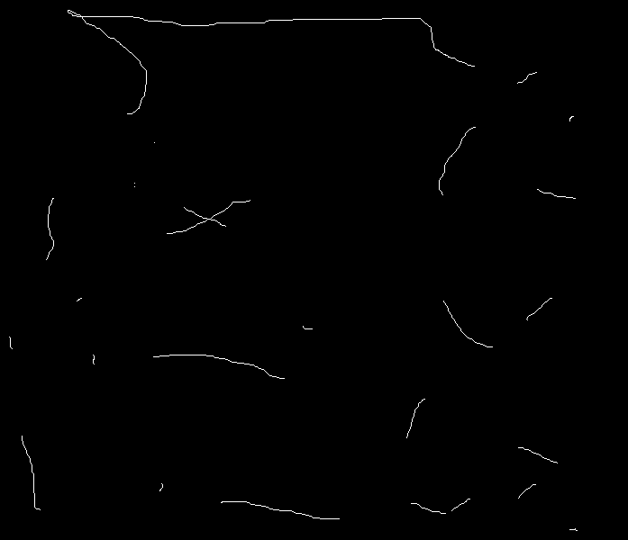

| Image     | Seeds| Segmented |
| ----------- | ----------- | ----------- |
|   |     | |

# semi-supervised-segmentation-on-graphs
- This is a reporduction of this work:

- It solves time-dependent eikonal equation using GPU backend (pyopencl).

- Render the jupyternotebook here.

# Installation.
- One needs mainly `pyopencl` and `bufferkdtree` library to create the knn-graph and run the pde on GPU.
- `pip install -r requirements.txt` should work.

# Cite this:
